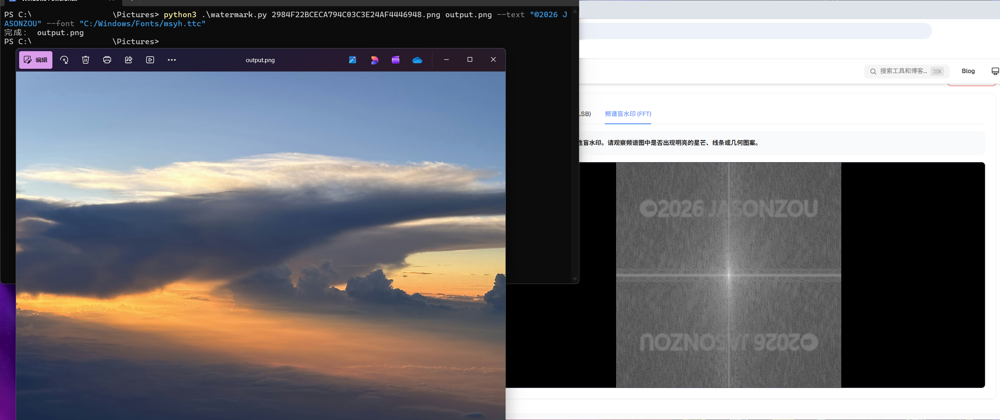
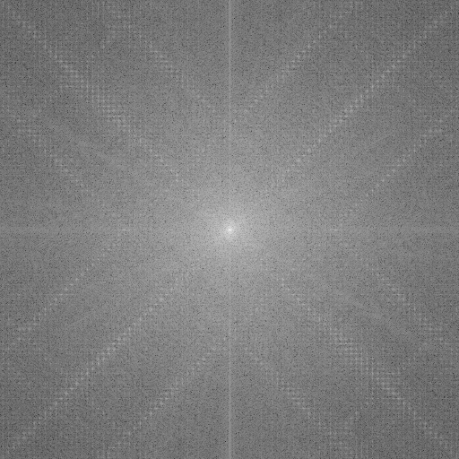
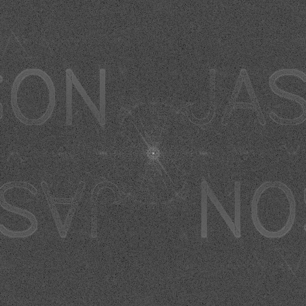
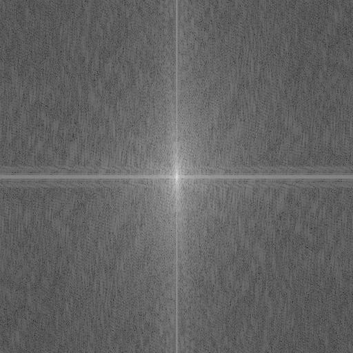

# FFT-WaterMark
一个使用GPT5.5生成的FFT水印（频谱水印）小玩具，抗压缩效果可见Test-Dir目录下文件

# 使用方法
安装依赖
```shell
pip install pillow numpy
```
添加水印
```shell
python3 .\watermark.py input.png output.png --text "WATERMARK" --font "C:/Windows/Fonts/msyh.ttc"
```
支持的参数
```shell
fftwatermark.py [-h] (--text TEXT | --mask MASK) [--font FONT] [--font-scale FONT_SCALE] [--offset-x OFFSET_X] [--offset-y OFFSET_Y] [--stroke STROKE] [--blur BLUR] [--invert-mask] [--rmin RMIN] [--rmax RMAX] [--fade FADE] [--alpha ALPHA] [--max-delta MAX_DELTA] [--clip-delta CLIP_DELTA] [--jpg-quality JPG_QUALITY] [--save-preview] [--jpeg-test-quality JPEG_TEST_QUALITY] input output

给彩色图片添加 FFT 频谱文字/结构水印

positional arguments:
  input                 输入原图
  output                输出图片，推荐 PNG 或高质量 JPG

options:
  -h, --help            show this help message and exit
  --text TEXT           要写入频谱的文字，例如 'NO AI'
  --mask MASK           黑底白字/白图形的频域水印图片
  --font FONT           字体文件路径，中文必须指定
  --font-scale FONT_SCALE
                        文字大小
  --offset-x OFFSET_X   频谱中文字水平偏移，单位为图宽比例
  --offset-y OFFSET_Y   频谱中文字垂直偏移，单位为图高比例
  --stroke STROKE       文字描边粗细
  --blur BLUR           频域 mask 模糊半径
  --invert-mask         反转外部 mask 黑白
  --rmin RMIN           最低嵌入频率，过低可能肉眼可见
  --rmax RMAX           最高嵌入频率，过高不抗 JPG
  --fade FADE           频带边缘渐变宽度
  --alpha ALPHA         频谱水印强度
  --max-delta MAX_DELTA
                        主要亮度扰动上限，单位灰度级
  --clip-delta CLIP_DELTA
                        极端亮度扰动裁剪，单位灰度级
  --jpg-quality JPG_QUALITY
                        输出 JPG 质量
  --save-preview        保存 FFT 频谱预览图
  --jpeg-test-quality JPEG_TEST_QUALITY
                        额外生成 JPG 压缩测试质量
```
注：默认参数针对的是示例中的字体，其他字体（包括缺省）需要自行调节font-scal等参数
# 使用的提示词
请生成一段代码，用途为为彩色图片添加特定字符字样的频谱水印（FFT），使用python，要求为输入原图，生成的图片在肉眼上无法辨别，但是在类似 https://basetoolbox.com/zh/hidden-info/ 的网站上能见到结构（图1）或者文字（图2），抗jpg压缩，正常图片的输入输出见图三图四



